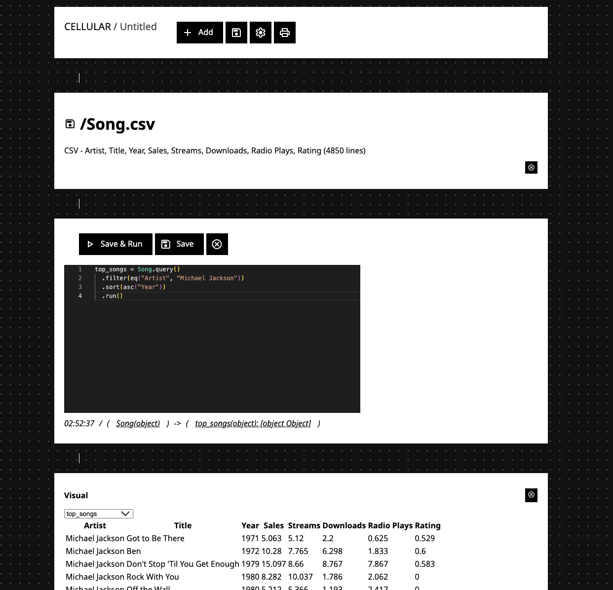

# Cellular

Quickly import data, massage it with JavaScript and visualize it. Like R Studio, just without R.

(This is currently rather in a proof of concept stage, expect bugs and missing features)

## Quick Start

1. Create a new _model_ ("storybook") in a _workspace_ of your choice (workspaces can be used to separate files and models of different projects)
2. Add your data by adding _datasources_, or just drag and drop files into the model
3. Add a _visualization_ by just picking the right graph and dimensions from the dropdowns
4. Need some data wrangling? Add a _script_ between the datasource and visualization. You can refer to the datasource through variables, variables created in the script can then be used as the input for the visualization
5. Want to leave some comments or documentation? Add a markdown node! Cellular will automatically arrange nodes to a nice layout

## Features (so far)

**Workspace & UI**
- Group files and models into workspaces
- Workspaces are stored in IndexedDB in the browser, allowing to work with the data locally across browser sessions
- Upload Files to Workspaces
- TODO: Delete Files from Workspaces
- TODO: Export Workspaces
- TODO: Arrange files in folders

**Model & Blocks**
- Create new Models, TODO: rename them
- Print Models (TODO: improve)
- TODO: Save Models
- Blocks are automatically rearranged to fill the display space, and group things visually together
- Add new Blocks at the end of a plan, TODO: Add Blocks in the middle

**Data Sources**
- Upload Files into a Workspace (also via Drag and Drop)
- TODO: JSON Files are automatically parsed and exposed as _Tables_
- CSV Files are automatically parsed and exposed as _Tables_
- TODO: TXT Files are available as strings, other files as ArrayBuffer
- TODO: Data Preview for Strings
- TODO: Data Preview for Tables
- TODO: 

**Scripts**
- Edit JavaScript with Syntax Highlighting
- Global Variables are automatically detected as Output and are available to following blocks
- Variables used to read output from previous blocks are automatically detected and are wired in the Cellular Model
- Scripts can be run, rerunning them will invalidate Blocks building on it
- The library can be used in scripts and Typescript types are available for it
- Types are inferred for input variables

**Script Library**
- Table to represent a two-dimensional grid with columns and rows
- Small Query Language to work with Tables (`.query().<ops ...>().run()`)
  - TODO: Projection
  - Filter (`.filter(<predicate>)`)
  - Sort (`.sort(<order, ...>)`)
  - TODO: Join

Predicates:
  - `eq("<column name>", <column value>)`
  - `and(<predicate, ...>)`, `or(<predicate, ...>)`

Ordering:
  - `asc("<column name>")`
  - `desc("<column name>")`

**Visualization**
- Show JSON as a tree
- TODO: Text
- TODO: Simple Graphs

## Building and Running

Install dependencies with `npm ci`, then run a local development server with `npm start`. TODO: Reduce dependencies and clean up public.

## Structure & Inner Workings

### /model

Describes Cellular Models and provides utilities to modify them. The Cellular Model is an acyclic graph of Blocks, the most common block types are _datasource_, _javascript_ and _visualize_. Each Block provides output variables of a certain type, following Blocks can use these variables as their input.

## /runtime

The JavaScript runtime to parse data sources, execute scripts and modify the model.

## /library

Data structures and algorithms that can be used inside Script blocks and which are used to represent data sources, such as the `Table` class and the framework around it to work with tabular data.

## /ui

The React App for displaying models and interacting with the runtime. Base components can be found in `/ui/base`, no third party dependencies.